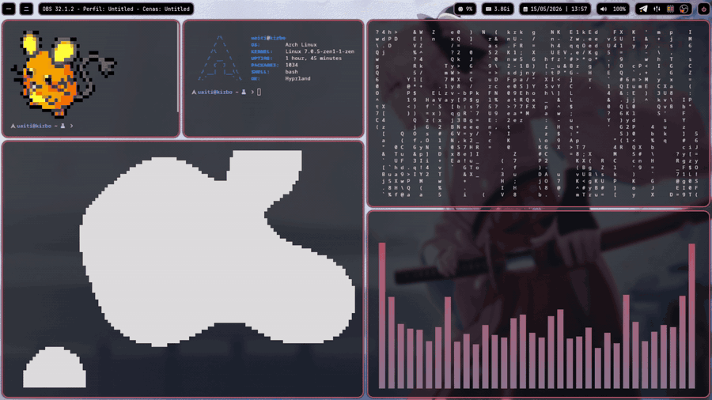
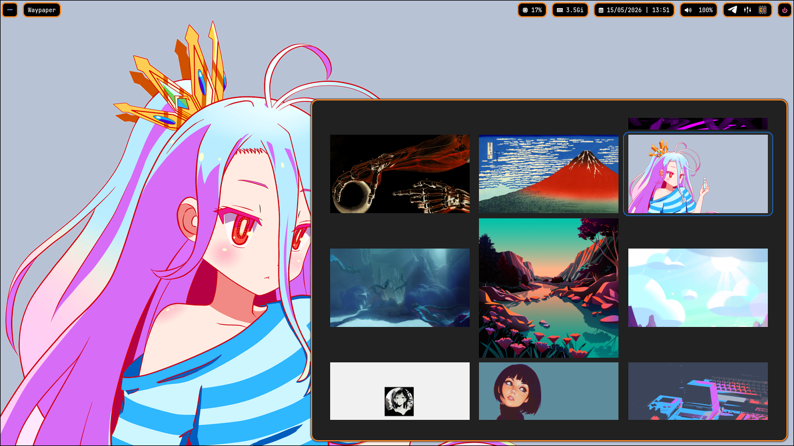

<div align="center">

# uaitiDots

Minhas configs básicas para Arch Linux + Hyprland.



<br>

<table>
  <tr>
    <td align="center" width="50%">
      
      <br>
      <sub>Hyprland + Waybar</sub>
    </td>
    <td align="center" width="50%">
      
      <br>
      <sub>Wallpapers + Wallust</sub>
    </td>
  </tr>
</table>

</div>

## Conteúdo

- `.config/dunst`
- `.config/hypr`
- `.config/kitty`
- `.config/nvim`
- `.config/obs-cava`
- `.config/rofi`
- `.config/wallust`
- `.config/waybar`
- `.bashrc`
- `wallpapers/`
- `pkglist.txt`: pacotes dos repositórios oficiais
- `aurlist.txt`: pacotes do AUR
- `scripts/install.sh`: instalador

## Instalação

```bash
git clone https://github.com/uaitibat/rice.git
cd rice
chmod +x scripts/install.sh
./scripts/install.sh
```

O script:

1. ativa o repositório `multilib` em `/etc/pacman.conf`;
2. instala `git`, `base-devel` e `yay`, se necessário;
3. instala os pacotes da `pkglist.txt` com `pacman`;
4. instala os pacotes da `aurlist.txt` com `yay`;
5. copia as configs de `.config/` para `~/.config/`;
6. copia `.bashrc` para `~/.bashrc`;
7. copia os wallpapers para `~/Pictures/wallpapers/`.

<div align="center">


</div>

## Observação

Revise as listas e faça backup das configs atuais antes de rodar em uma instalação existente.
